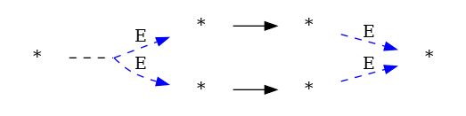
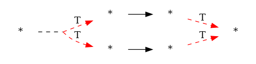
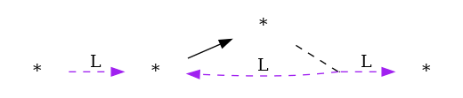
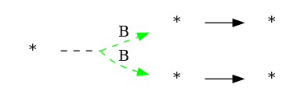
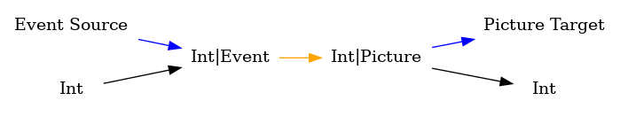
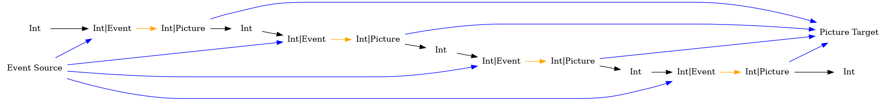
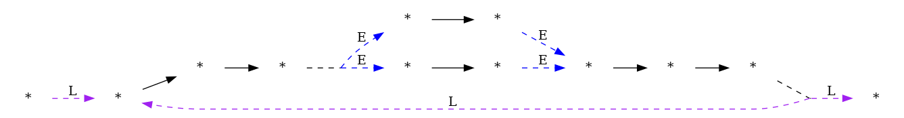
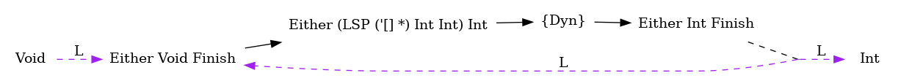

# dui
一些关于流处理的思考，以及基于流处理器的GUI框架。

对于有输入，输出的流处理单元，最好的建模方式是Arrow（参考这篇文章[arrows](http://www.cse.chalmers.se/~rjmh/Papers/arrows.pdf)）。论文的第六章：Stream Processors: Processes as Arrows 介绍了如何用Arrow构建复杂的流处理器。

底层的流处理器:
```haskell
data SP i o a
  = Get (i -> SP i o a)
  | Put o (SP i o a)
  | Return a
```

如何组合流处理器:
```haskell
data LSP (outputs :: [Type]) i o where
  L :: SP i o () -> LSP '[] i o
  (:>>>) :: LSP xs i o -> LSP ys o p -> LSP (xs :++: ys) i p
  (:+++) ::
    LSP xs i1 o1 ->
    LSP ys i2 o2 ->
    LSP (xs :++: ys) (Either i1 i2) (Either o1 o2)
  (:***) ::
    LSP xs i1 o1 ->
    LSP ys i2 o2 ->
    LSP (xs :++: ys) (i1, i2) (o1, o2)
  LoopEither ::
    LSP xs (Either i k) (Either o k) ->
    LSP xs i o
  (:>>+) ::
    LSP xs i o1 ->
    LSP ys i o2 ->
    LSP (xs :++: '[o1] :++: ys) i o2
  Dyn :: LSP xs (Either (LSP xs a b) a) b
  DebugRt :: LSP '[EvalState] a a
  E ::
    SP (Either i Event) (Either o Picture) () ->
    LSP '[] i o
```
流处理的组合与程序的组合有相似的地方，都涉及到了顺序，分支，循环着三种主要结构。

```haskell
  L :: SP i o () -> LSP '[] i o
```
使用底层流处理器构成LSP


```haskell
  (:>>>) :: LSP xs i o -> LSP ys o p -> LSP (xs :++: ys) i p
```
顺序连接两个流处理器


```haskell
  (:+++) :: LSP xs i1 o1 -> LSP ys i2 o2 -> LSP (xs :++: ys) (Either i1 i2) (Either o1 o2)
```
把两个流处理器组合成一个处理器。上游的Either值会选择性的发送到下游的某一个处理器，具有分支语义。





```haskell
  (:***) :: LSP xs i1 o1 -> LSP ys i2 o2 -> LSP (xs :++: ys) (i1, i2) (o1, o2)
```
把两个流处理器组合成一个处理器。上游Tuple值的两部分会同时发送到下游的两个流处理器。这也算一种分支语义。





```haskell
  LoopEither :: LSP xs (Either i k) (Either o k) -> LSP xs i o
```
流处理器输出Right值会返回到输入端。具有循环语义。





```haskell
  (:>>+) :: LSP xs i o1 -> LSP ys i o2 -> LSP (xs :++: '[o1] :++: ys) i o2
```
把两个流处理器组合成一个处理器。上游的值会同时发送到两个流处理器，第一个流处理器的输出会被运行时收集，第二个流处理器的输出正常发送到下游。这给组合器是我特地添加上去的，这也是LSP 类型签名里(outputs :: [Type])的由来。





```haskell
  Dyn :: LSP xs (Either (LSP xs a b) a) b
```
上游动态产生(LSP xs a b)或者(a)。Dyn将上游发送的(LSP xs a b)动态生成为运行时节点，
将上游发送的(a)送入动态产生节点的输入中。


```haskell
  E :: SP (Either i Event) (Either o Picture) () -> LSP '[] i o
```
代表ui的流处理器。

以下是一个例子：

```haskell
te :: SP (Either Int Event) (Either Int Picture) ()
te = Get $ \case
  Left v -> Put (Left v) te
  Right Event -> Put (Right Picture) te

lsp = E te
lsp' = lsp :>>> lsp :>>> lsp :>>> lsp
```
lsp 的示意图如下



当多个这样lsp连接时，会有如下的示意图




--------------------
以下是求某数冰雹数列的一个实例：
```haskell
cvsp :: [Int] -> SP Int (Either [Int] Int) ()
cvsp xs = Get $ \x ->
  if x `elem` vs
    then Put (Left $ reverse (x : xs)) $ cvsp []
    else Put (Right x) $ cvsp (x : xs)

ge :: Int -> Either Int Int
ge i = if odd i then Left i else Right i

lp =
  LoopEither
    ( arrLSP bothC
        :>>> arrLSP ge
        :>>> (arrLSP (\x -> x * 3 + 1) ||| arrLSP (`div` 2))
        :>>> E (cvsp [])
    )

-- >>> rlp
-- Just ({},[[16,8,4]])
rlp = runLSPWithOutputs [5] lp
```
整个流处理器的连接图




--------------------
下面是一个Dyn的例子：

```haskell
ch ::
  ( BottomSP
      (Either Void Finish)
      (Either (LSP '[] Int Int) Int)
      sig
      m
  ) =>
  m ()
ch = do
  putToDownstream $ Left (arrLSP (+ 1))
  putToDownstream $ Right 1
  putToDownstream $ Right 2
  putToDownstream $ Right 3
  res <- getFromUpstream
  case res of
    Right Finish -> pure ()
    _ -> error "never happened"
  putToDownstream $ Left (arrLSP (+ 1000))
  putToDownstream $ Right 1
  putToDownstream $ Right 2
  putToDownstream $ Right 3
  res <- getFromUpstream
  case res of
    Right Finish -> pure ()
    _ -> error "never happened"

ct ::
  ( Has (State Int) sig m,
    BottomSP Int (Either Int Finish) sig m
  ) =>
  m ()
ct = forever $ do
  x <- getFromUpstream
  modify @Int (+ 1)
  putToDownstream (Left x)
  i <- S.get @Int
  when (i == 3) $ do
    putToDownstream (Right Finish)
    S.put @Int 0

pp1 = LoopEither (runLToLSP ch :>>> Dyn :>>> runLToLSP (runState @Int 0 ct))

-- >>> showLSP pp1
-- >>> runLSPWithOutputs [] pp1
-- Just ({},[2,3,4,1001,1002,1003])
```

整个流处理器的连接图



Dyn最好和LoopEither一起使用。在动态创建节点的时候可能前一次创建的节点内部还有数据没处理完成，因此使用LoopEither将首尾节点连接起来，这样尾部节点能告知头部节点：上一次动态生成的节点是否处理了所有数据。
